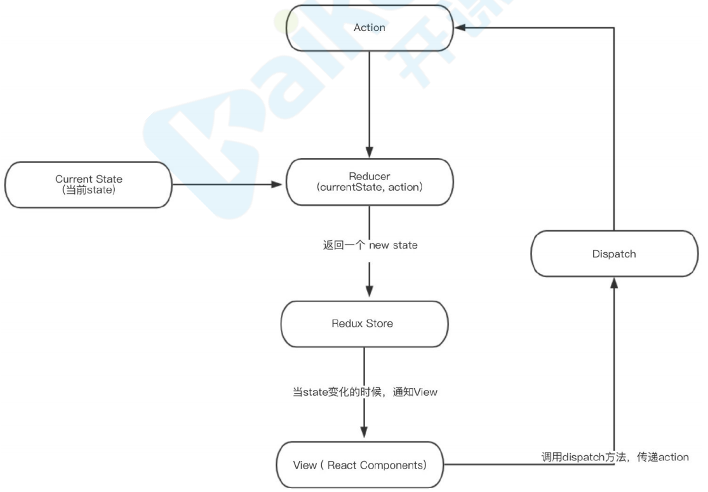

## React 入门

[React](https://zh-hans.reactjs.org/)
https://zh-hans.reactjs.org/
[create-react-app](https://create-react-app.dev/docs/getting-started/)
https://create-react-app.dev/docs/getting-started/

##### 开始

1. 创建项⽬： npx create-react-app my-app
2. 打开项⽬： cd my-app
3. 启动项⽬： npm start
4. 暴露配置项： npm run eject

##### cra ⽂件结构

```
├── README.md          ⽂档
├── public             静态资源
│  ├── favicon.ico
│  ├── index.html
│  └── manifest.json
└── src                源码
    ├── App.css
    ├── App.js          根组件
    ├── App.test.js
    ├── index.css        全局样式
    ├── index.js         ⼊⼝⽂件
    ├── logo.svg
    └── serviceWorker.js pwa⽀持
├── package.json         npm 依赖
```

⼊⼝⽂件定义，webpack.confifig.js

```js
entry: [
// WebpackDevServer客户端，它实现开发时热更新功能
isEnvDevelopment &&
require.resolve('react-dev-utils/webpackHotDevClient'),
// 应⽤程序⼊⼝：src/index
paths.appIndexJs,
].filter(Boolean),
```

webpack.confifig.js 是 webpack 配置⽂件，开头的常量声明可以看出 cra 能够⽀持 ts、sass 及 css 模块化。

```js
// Check if TypeScript is setup
const useTypeScript = fs.existsSync(paths.appTsConfig)
// style files regexes
const cssRegex = /\.css$/
const cssModuleRegex = /\.module\.css$/
const sassRegex = /\.(scss|sass)$/
const sassModuleRegex = /\.module\.(scss|sass)$/
```

> React 负责逻辑控制，数据 -> VDOM
>
> ReactDom 渲染实际 DOM，VDOM -> DOM
>
> React 使⽤ JSX 来描述 UI
>
> babel-loader 把 JSX 编译成相应的 JS 对象，React.createElement 再把这个 JS 对象构造成 React 需
>
> 要的虚拟 dom。

## JSX 语法

JSX 是⼀种 JavaScript 的语法扩展，其格式⽐较像模版语⾔，但事实上完全 是在 JavaScript 内部实现的。 JSX 可以很好地描述 UI，能够有效提⾼开发效率，体验[JSX]([JSX 简介 – React (reactjs.org)](https://zh-hans.reactjs.org/docs/introducing-jsx.html))

```js
// 基本使用 - 表达式{}
const name = 'react study'
const jsx = <div>hello, {name}</div>

// 函数 - 其实也是合法表达式
const user = {
  fistName: 'Harry',
  lastName: 'Potter'
}
function formatName(name) {
  return name.fistName + ' ' + name.lastName
}
const jsx = <div>{formatName(user)}</div>

// JSX对象 -  jsx是js对象，也是合法表达式
const greet = <div>good</div>
const jsx = <div>{greet}</div>

// 条件语句 - 条件语句可以基于上⾯结论实现
const show = true //false;
const greet = <div>good</div>
const jsx = (
  <div>
    {/* 条件语句 */}
    {show ? greet : '登录'}
    {show && greet}
  </div>
)

// 数组 - 数组会被作为⼀组⼦元素对待，数组中存放⼀组jsx可⽤于显示列表数据
const a = [0, 1, 2]
const jsx = (
  <div>
    {/* 数组 */}
    <ul>
      {/* diff时候，⾸先⽐较type，然后是key，所以同级同类型元素， key值必须得 唯⼀ */}
      {a.map(item => (
        <li key={item}>{item}</li>
      ))}
    </ul>
  </div>
)

// 属性的使⽤
import logo from './logo.svg'
const jsx = (
  <div>
    {/* 属性：静态值⽤双引号，动态值⽤花括号；class、for等要特殊处 理。 */}
    
  </div>
)

// CSS 模块化
import style from './index.module.css'
;

// 或者npm install sass -D
import style from './index.module.scss'
;
```

## 组件

组件，从概念上类似于 JavaScript 函数。它接受任意的⼊参（即 “props”），并返回⽤于描述⻚⾯展示 内容的 React 元素。 组件有两种形式：class 组件和 function 组件。[组件&Props]([组件 & Props – React (reactjs.org)](https://zh-hans.reactjs.org/docs/components-and-props.html))

### class 组件

class 组件通常拥有状态和⽣命周期，继承于 Component，实现 render ⽅法。⽤ class 组件创建⼀个 Clock：

```js
import React, { Component } from 'react'
export default class ClassComponent extends React.Component {
  constructor(props) {
    super(props)
    // 使⽤state属性维护状态，在构造函数中初始化状态
    this.state = { date: new Date() }
  }
  componentDidMount() {
    // 组件挂载之后启动定时器每秒更新状态
    this.timerID = setInterval(() => {
      // 使⽤setState⽅法更新状态
      this.setState({
        date: new Date()
      })
    }, 1000)
  }
  componentWillUnmount() {
    // 组件卸载前停⽌定时器
    clearInterval(this.timerID)
  }
  componentDidUpdate() {
    console.log('componentDidUpdate')
  }
  render() {
    return <div>{this.state.date.toLocaleTimeString()}</div>
  }
}
```

### function 组件

函数组件通常⽆状态，仅关注内容展示，返回渲染结果即可。

> 从 React16.8 开始引⼊了 hooks，函数组件也能够拥有状态。

⽤ function 组件创建⼀个 Clock：

```js
import React, { useState, useEffect } from 'react'
export function FunctionComponent(props) {
  const [date, setDate] = useState(new Date())
  useEffect(() => {
    //副作⽤
    const timer = setInterval(() => {
      setDate(new Date())
    }, 1000)
    return () => clearInterval(timer) //组件卸载的时候执⾏
  }, [])
  return (
    <div>
      <h3>FunctionComponent</h3>
      <p>{date.toLocaleTimeString()}</p>
    </div>
  )
}
```

## 正确使⽤ setState

[State & 生命周期]([State & 生命周期 – React (reactjs.org)](https://zh-hans.reactjs.org/docs/state-and-lifecycle.html))

`setState(partialState, callback)`

1. partialState : object|function ⽤于产⽣与当前 state 合并的⼦集。

2. callback : function state 更新之后被调⽤。

##### 关于 setState() setState() 你应该了解三件事：

1. 不要直接修改 State

   ```js
   // 错误示范
   this.state.comment = 'Hello'
   // 正确使⽤
   this.setState({ comment: 'Hello' })
   ```

2. State 的更新可能是异步的

   出于性能考虑，React 可能会把多个 setState() 调⽤合并成⼀个调⽤。 观察以下例⼦中 log 的值和 button 显示的 counter。

   ```jsx
   import React, { Component } from 'react'
   export default class SetStatePage extends Component {
     constructor(props) {
       super(props)
       this.state = {
         counter: 0
       }
     }
     changeValue = v => {
       this.setState({
         counter: this.state.counter + v
       })
       console.log('counter', this.state.counter)
     }
     setCounter = () => {
       this.changeValue(1)
       //this.changeValue(2);
       //console.log("counter", this.state.counter);
     }
     render() {
       const { counter } = this.state
       return (
         <div>
           <h3>SetStatePage</h3>
           <button onClick={this.setCounter}>{counter}</button>
         </div>
       )
     }
   }
   ```

如果要获取到最新状态值有以下⽅式:

```jsx
// 1. 在回调中获取状态值
changeValue = v => {
 this.setState(
 {
 counter: this.state.counter + v
 },
 () => {
 console.log("counter", this.state.counter);
 }
 );
};

// 2. 使用定时器
setTimeout(() => {
 this.setCounter();
}, 0);

// 3.原⽣事件中修改状态
componentDidMount(){
 document.body.addEventListener('click', this.changeValue, false)
}
```

> 总结： setState 只有在合成事件和⽣命周期函数中是异步的，在原⽣事件和 setTimeout 中都是同步 的，这⾥的异步其实是批量更新

3.State 的更新会被合并

```jsx
changeValue = v => {
  this.setState({
    counter: this.state.counter + v
  })
}
setCounter = () => {
  this.changeValue(1)
  this.changeValue(2)
}

// 如果想要链式更新state:
changeValue = v => {
  this.setState(state => ({ counter: state.counter + v }))
}
setCounter = () => {
  this.changeValue(1)
  this.changeValue(2)
}
```

## 组件复合

[组合 vs 继承]([组合 vs 继承 – React (reactjs.org)](https://zh-hans.reactjs.org/docs/composition-vs-inheritance.html))

复合组件给与你⾜够的敏捷去定义⾃定义组件的外观和⾏为，这种⽅式更明确和安全。如果组件间有公 ⽤的⾮ UI 逻辑，将它们抽取为 JS 模块导⼊使⽤⽽不是继承它。

#### 不具名

```jsx
import React, { Component } from 'react'
import TopBar from '../components/TopBar'
import BottomBar from '../components/BottomBar'
export default class Layout extends Component {
  componentDidMount() {
    const { title = '商城' } = this.props
    document.title = title
  }
  render() {
    const { children, showTopBar, showBottomBar } = this.props
    console.log('children', children)
    return (
      <div>
        {showTopBar && <TopBar />}
        {children.content}
        {children.txt}
        <button onClick={children.btnClick}>button</button>
        {showBottomBar && <BottomBar />}
      </div>
    )
  }
}
```

```jsx
import React, { Component } from 'react'
import Layout from './Layout'
export default class UserPage extends Component {
  render() {
    return (
      <Layout showTopBar={true} showBottomBar={true} title="⽤户中⼼">
        <div>
          <h3>UserPage</h3>
        </div>
      </Layout>
    )
  }
}
```

#### 具名

传个对象进去：

```jsx
import React, { Component } from 'react'
import Layout from './Layout'
export default class HomePage extends Component {
  render() {
    return (
      <Layout showTopBar={false} showBottomBar={true} title="商城⾸⻚">
        {/* <div>
 <h3>HomePage</h3>
 </div> */}
        {{
          content: (
            <div>
              <h3>HomePage</h3>
            </div>
          ),
          txt: '这是个⽂本',
          btnClick: () => {
            console.log('btnClick')
          }
        }}
      </Layout>
    )
  }
}
```

实现⼀个简单的复合组件，如 antD 的 Card

```jsx
import React, { Component } from 'react'
function Card(props) {
  return <div xu="card">{props.children}</div>
}
function Formbutton(props) {
  return (
    <div className="Formbutton">
      <button onClick={props.children.defaultBtns.searchClick}>默认查询</button>
      <button onClick={props.children.defaultBtns.resetClick}>默认重置</button>
      {props.children.btns.map((item, index) => {
        return (
          <button key={'btn' + index} onClick={item.onClick}>
            {item.title}
          </button>
        )
      })}
    </div>
  )
}
export default class CompositionPage extends Component {
  render() {
    return (
      <div>
        <Card>
          <p>我是内容</p>
        </Card>
        CompositionPage
        <Card>
          <p>我是内容2</p>
        </Card>
        <Formbutton>
          {{
            /* btns: (
 <>
 <button onClick={() => console.log('enn')}>查询</button>
 <button onClick={() => console.log('enn2')}>查询2</button>
 </>
 ) */
            defaultBtns: {
              searchClick: () => console.log('默认查询'),
              resetClick: () => console.log('默认重置')
            },
            btns: [
              {
                title: '查询',
                onClick: () => console.log('查询')
              },
              {
                title: '重置',
                onClick: () => console.log('重置')
              }
            ]
          }}
        </Formbutton>
      </div>
    )
  }
}
```

## redux

[redux]([自述 · Redux](https://www.redux.org.cn/))

何时应该使用 redux

- 你有着相当⼤量的、随时间变化的数据；
- 你的 state 需要有⼀个单⼀可靠数据来源；
- 你觉得把所有 state 放在最顶层组件中已经⽆法满⾜需要了。
- 某个组件的状态需要共享。

redux 是 JavaScript 应⽤的状态容器，提供可预测化的状态管理。它保证程序⾏为⼀致性且易于测试。



### 安装 redux

`npm install redux --save`

### redux 上⼿

⽤⼀个累加器举例

1. 需要⼀个 store 来存储数据

2. store ⾥的 reducer 初始化 state 并定义 state 修改规则

3. 通过 dispatch ⼀个 action 来提交对数据的修改

4. action 提交到 reducer 函数⾥，根据传⼊的 action 的 type，返回新的 state

创建 store，src/store/ReduxStore.js

```jsx
import { createStore } from 'redux'
const counterReducer = (state = 0, action) => {
  switch (action.type) {
    case 'ADD':
      return state + 1
    case 'MINUS':
      return state - 1
    default:
      return state
  }
}
const store = createStore(counterReducer)
export default store
```

创建 ReduxPage

```jsx
import React, { Component } from 'react'
import store from '../store/ReduxStore'
export default class ReduxPage extends Component {
  componentDidMount() {
    store.subscribe(() => {
      console.log('subscribe')
      this.forceUpdate()
      //this.setState({});
    })
  }
  add = () => {
    store.dispatch({ type: 'ADD' })
  }
  minus = () => {
    store.dispatch({ type: 'MINUS' })
  }
  render() {
    console.log('store', store)
    return (
      <div>
        <h3>ReduxPage</h3>
        <p>{store.getState()}</p>
        <button onClick={this.add}>add</button>
        <button onClick={this.minus}>minus</button>
      </div>
    )
  }
}
```

> 如果点击按钮不能更新，因为没有订阅(subscribe)状态变更

还可以在 src/index.js 的 render ⾥订阅状态变更

```jsx
import store from './store/ReduxStore'
const render = () => {
  ReactDom.render(<App />, document.querySelector('#root'))
}
render()
store.subscribe(render)
```

### 总结

1. createStore 创建 store
2. reducer 初始化、修改状态函数
3. getState 获取状态值
4. dispatch 提交更新
5. subscribe 变更订阅

## react-redux

[React Redux]([react-redux 文档 · Redux](https://www.redux.org.cn/docs/react-redux/))

#### 安装

`npm install react-redux --save`

### 使⽤ react-redux

react-redux 提供了两个 api

1. Provider 为后代组件提供 store

2. connect 为组件提供数据和变更⽅法

全局提供 store，index.js

```jsx
import React from 'react'
import ReactDom from 'react-dom'
import App from './App'
import store from './store/'
import { Provider } from 'react-redux'
ReactDom.render(
  <Provider store={store}>
    <App />
  </Provider>,
  document.querySelector('#root')
)
```

获取状态数据，ReactReduxPage.js

```jsx
import React, { Component } from 'react'
import { connect } from 'react-redux'
class ReactReduxPage extends Component {
  render() {
    const { num, add, minus } = this.props
    return (
      <div>
        <h1>ReactReduxPage</h1>
        <p>{num}</p>
        <button onClick={add}>add</button>
        <button onClick={minus}>minus</button>
      </div>
    )
  }
}
const mapStateToProps = state => {
  return {
    num: state
  }
}
const mapDispatchToProps = {
  add: () => {
    return { type: 'add' }
  },
  minus: () => {
    return { type: 'minus' }
  }
}
export default connect(
  mapStateToProps, //状态映射 mapStateToProps
  mapDispatchToProps //派发事件映射
)(ReactReduxPage)
```

> connect 中的参数：state 映射和事件映射

## react-router

[react-router]([React Router: Declarative Routing for React.js](https://reactrouter.com/web/guides/quick-start))

[React Router 中文文档]([Introduction | React Router 中文文档 (react-guide.github.io)](https://react-guide.github.io/react-router-cn/index.html))

react-router 包含 3 个库，react-router、react-router-dom 和 react-router-native。react-router 提供最 基本的路由功能，实际使⽤的时候我们不会直接安装 react-router，⽽是根据应⽤运⾏的环境选择安装 react-router-dom（在浏览器中使⽤）或 react-router-native（在 rn 中使⽤）。react-router-dom 和 react-router-native 都依赖 react-router，所以在安装时，react-router 也会⾃动安装，创建 web 应⽤，

#### 安装

`npm install --save react-router-dom`

#### 基本使⽤

react-router 中奉⾏⼀切皆组件的思想，路由器-Router、链接-Link、路由-Route、独占-Switch、重 定向-Redirect 都以组件形式存在

创建 RouterPage.js

```jsx
import React, { Component } from 'react'
import { BrowserRouter as Router, Route, Link } from 'react-router-dom'
export default class RouterPage extends Component {
  render() {
    return (
      <div>
        <h3>RouterPage</h3>
        <Router>
          <Link to="/">⾸⻚</Link>
          <Link to="/user">⽤户中⼼</Link>
          {/* 根路由要添加exact，实现精确匹配 */}
          <Route
            exact
            path="/"
            component={HomePage}
            //children={() => <div>children</div>}
            //render={() => <div>render</div>}
          />
          <Route path="/user" component={UserPage} />
        </Router>
      </div>
    )d
  }
}
class HomePage extends Component {
  render() {
    return (
      <div>
        <h3>HomePage</h3>
      </div>
    )
  }
}
class UserPage extends Component {
  render() {
    return (
      <div>
        <h3>UserPage</h3>
      </div>
    )
  }
}
```

#### Route 渲染内容的三种⽅式

Route 渲染优先级：children>component>render。

这三种⽅式互斥，你只能⽤⼀种。

### children：func

有时候，不管 location 是否匹配，你都需要渲染⼀些内容，这时候你可以⽤ children。

除了不管 location 是否匹配都会被渲染之外，其它⼯作⽅法与 render 完全⼀样。

### render：func

但是当你⽤ render 的时候，你调⽤的只是个函数。

只在当 location 匹配的时候渲染。

### component: component

只在当 location 匹配的时候渲染。

### 404 ⻚

设定⼀个没有 path 的路由在路由列表最后⾯，表示⼀定匹配

```jsx
{
  /* 添加Switch表示仅匹配⼀个*/
}
;<Switch>
  {/* 根路由要添加exact，实现精确匹配 */}
  <Route exact path="/" component={HomePage} />
  <Route path="/user" component={UserPage} />
  <Route component={EmptyPage} />
</Switch>
class EmptyPage extends Component {
  render() {
    return (
      <div>
        <h3>EmptyPage-404</h3>
      </div>
    )
  }
}
```

## PureComponent

[React 顶层 API – React (reactjs.org)](https://zh-hans.reactjs.org/docs/react-api.html#reactpurecomponent)

### 实现性能优化

定制了shouldComponentUpdate后的Component

```
export default class PureComponentPage extends PureComponent {
 constructor(props) {
 super(props);
 this.state = {
 counter: 0,
 // obj: {
 // num: 2,
 // },
 };
 }
 setCounter = () => {this.setState({
 counter: 100,
 // obj: {
 // num: 200,
 // },
 });
 };
 render() {
 const { counter, obj } = this.state;
 console.log("render");
 return (
 <div>
 <h1>PuerComponentPage</h1>
 <div onClick={this.setCounter}>counter: {counter}</div>
 </div>
 );
 }
}
```

### 浅比较

缺点是必须要⽤class形式，⽽且要注意是浅⽐较

### 与Component

React.PureComponent 与 React.Component 很相似。两者的区别在于 React.Component 并未实 现 shouldComponentUpdate() ，⽽ React.PureComponent 中以浅层对⽐ prop 和 state 的⽅式来 实现了该函数。 如果赋予 React 组件相同的 props 和 state， render() 函数会渲染相同的内容，那么在某些情况下使 ⽤ React.PureComponent 可提⾼性能。

>注意 
>
>React.PureComponent 中的 shouldComponentUpdate() 仅作对象的浅层⽐较。如果对象中 包含复杂的数据结构，则有可能因为⽆法检查深层的差别，产⽣错误的⽐对结果。仅在你的 props 和 state 较为简单时，才使⽤ React.PureComponent ，或者在深层数据结构发⽣变化时 调⽤ forceUpdate() 来确保组件被正确地更新。你也可以考虑使⽤ immutable 对象加速嵌套
>
>数据的⽐较。 此外， React.PureComponent 中的 shouldComponentUpdate() 将跳过所有⼦组件树的 prop 更新。因此，请确保所有⼦组件也都是“纯”的组件。
